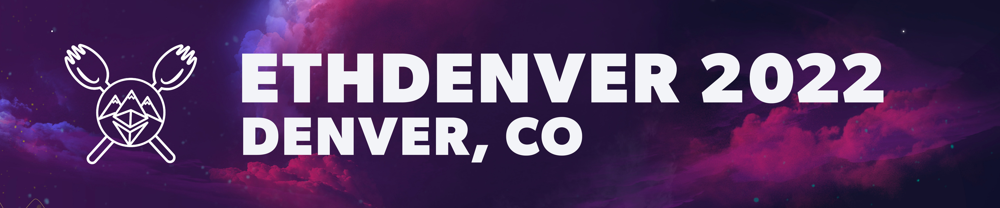

# Phala Workshop for ETHDenver 2022

Welcome to Phala's Workshop for ETHDenver 2022!
This repo is meant to provide the useful resources for your workshop experience.

## Intro: The Web3 infrastructure beyond smart contract
**Subtitle: Web3 Infrastructure: Send HTTPS requests in Fat Contract**

The development of Web3 and Metaverse raises new requirements on the blockchain infrastructure. A trend of running heavy-weight applications like real-time rendering and game servers on decentralized computing services is emerging.

In this workshop, we show how Phala provides trustless computing service of over tens of thousands of nodes, and present the Fat Contract which intends to serve compute-intensive and low-latency applications which have never been executed on-chain. With its Internet access ability, you are free to utilize any existing Web2 services with tens of lines of contract code, making it a perfect choice to connect the Web2 and Web3 world.

## About Phala Network

[Phala Network](https://phala.network/) is a Web3.0 computing cloud that supports data privacy while remaining trustless. Unlike centralized cloud service, Phala doesn’t own any server or data center. Anyone can provide permissionless servers into Phala Network, and because of a clever combination of blockchain and secure enclave, we can make sure the servers can’t be evil even when they are in an edge network situation. Together, this creates the infrastructure for a powerful, secure, and scalable trustless computing cloud.

Some useful resources include:
- [Main page](https://phala.network/)
- [Phala Wiki](https://wiki.phala.network/en-us/general/phala-network/01-phala-network/) about Phala applications, mining and Fat Contract development
- [Discord channel](https://discord.gg/myBmQu5) and [Forum](https://forum.phala.network/) to discuss with us and our community members directly
- [Medium](https://medium.com/phala-network) and [Twitter](https://twitter.com/PhalaNetwork) to learn about our latest progress

## Resources for this workshop

- The [event link](https://ethdenver.sched.com/event/vBYq/the-web3-infrastructure-beyond-smart-contract)
- The [rendering demo codebase](https://github.com/Phala-Network/blender-contract)
- The [workshop codebase](https://github.com/Phala-Network/fat-contract-workshop/tree/http)
